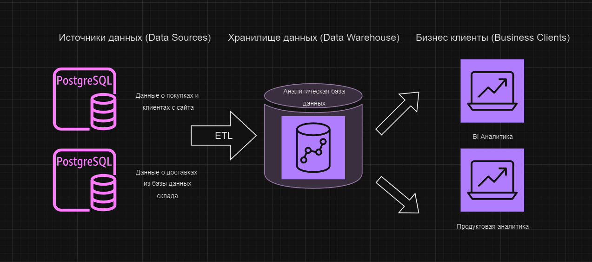
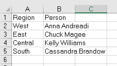
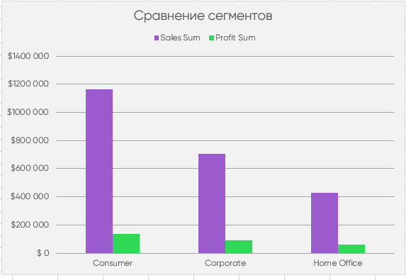
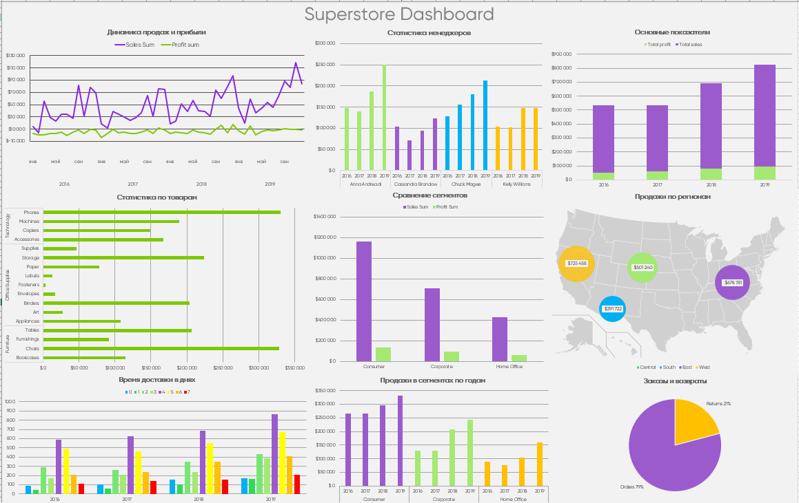

## Выполнение домашней работы
### 1. Архитектура аналитического решения
Т.к. я не имел дел с реальными аналитическими решениями, я делал архитектуру согласно датасету суперстор. Исходя из данных в датасете я предположил что это небольшой магазин.  Т.к. нет никаких метрик кроме статистики продаж и заказов, я делаю вывод что данные были загружены из двух баз данных - база данных магазина и база данных склада. Далее с помощью ETL процессов были обработаны и перегружены в аналитическую базу и оттуда уже ими могут воспользоваться аналитики. \
\

### 2. Соединяем таблицы
Таблицы соединил с помощью **ВПР**, для этого поменял местами столбцы в исходных таблицах, т.к. ВПР работает только когда столбец для соединения первый. \
\
 

В общей таблице несколько полей:
+ **Returned** с помощью функции **ЕСЛИОШИБКА(ВПР(Orders!B2; Returns!A2:B801; 2; 0); "No")**
+ **Manager** с помощью функции **ВПР(N2;People!$A$2:$C$5;2;0)**
+ **Delivery time** с помощью простого вычитания дат
+ **Average unit price** средняя цена товара в чеке

### 3. Делаем сводные таблицы и диаграммы
Я использовал следующие диаграммы:
+ Гистограмма
+ Гистограмма с накоплением
+ Круговая диаграмма
+ Картограмма сделанная на основе пузырькового графика
+ График
+ Линейчатая диаграмма
Пример диаграммы:\
\
 

### 4. Создаем дашборд
Здесь я просто скопировал диаграммы с листов, срезы настроить не получилось, из-за того
что я делал сводные таблицы и диаграммы в режиме совместимости. Даже после форматирования файла и отключения режима
ошибка не пропала. Поэтому это статичный дашборд. \
\
 